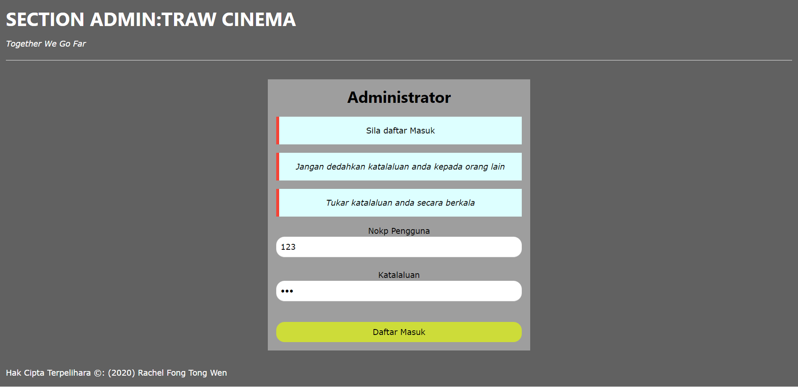
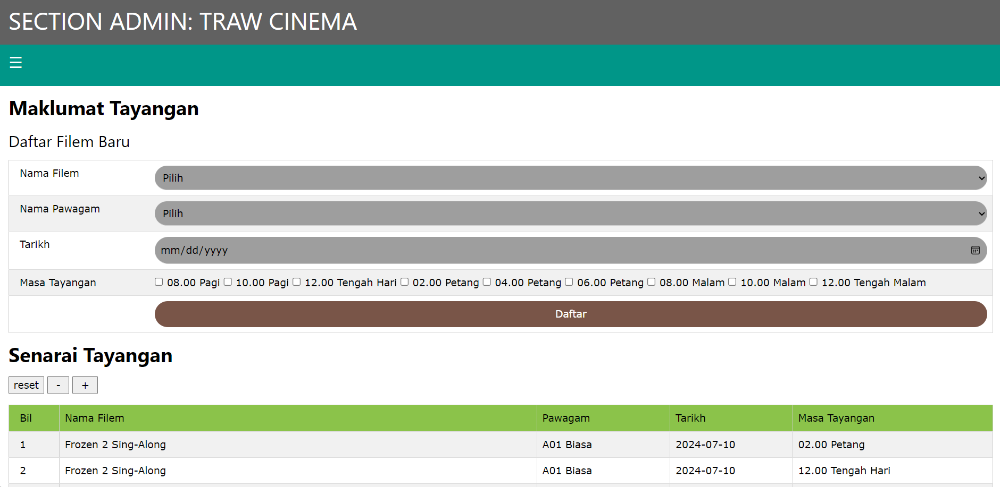
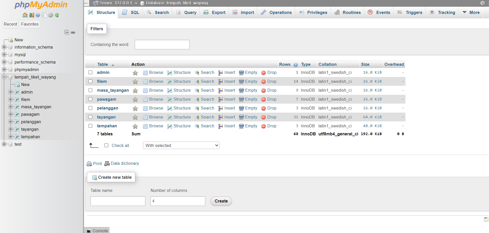

# A Simple Cinama Booking System 

### About This Project -
TRAW Cinema is a localhost website designed to streamline the cinema booking experience. Built using PHP, HTML, CSS, and powered by XAMPP with an SQL-based database, TRAW Cinema aims to revolutionize how users interact with cinema booking systems.

#### Features
- **User-Friendly Interface:** Easily browse movies, check showtimes, and book tickets.
- **Admin Dashboard:** Manage schedules, tickets, and user data efficiently.

#### Technologies Used
- **Backend**: PHP
- **Frontend**: HTML, CSS
- **Database**: SQL (MySQL)
- **Server**: XAMPP

### Screenshots
*Customer Main Page*

*Customer LogIn*

*Admin LogIn*

*Admin Manage Movie*

## Installation
To run TRAW Cinema locally:
1. Clone this repository.
2. Install XAMPP and start Apache and MySQL servers.
3. Import the SQL database from `wayang.sql`.
4. Navigate to `localhost:3000/` in your web browser.

## Getting Started
- Modify `connection.php` to set up your database credentials. (or you may set up a same database name at XAMPP: tempah_tiket_wayang)
 

- Customize the frontend design as needed.
- Add additional features or functionalities based on your requiremnts. 
